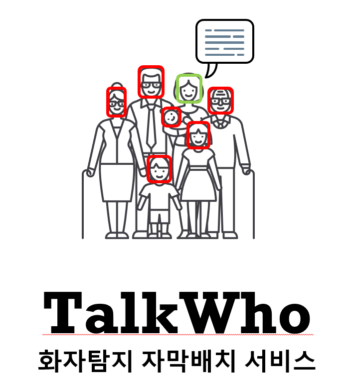
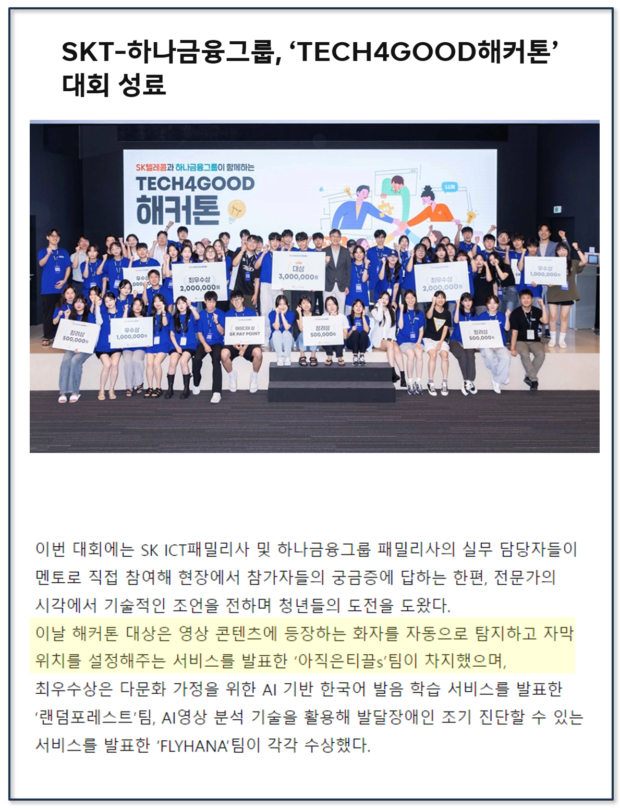
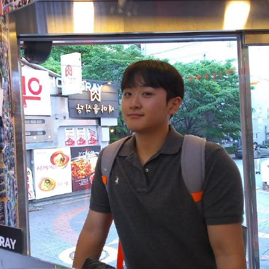
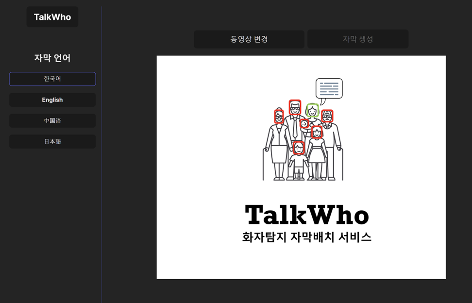
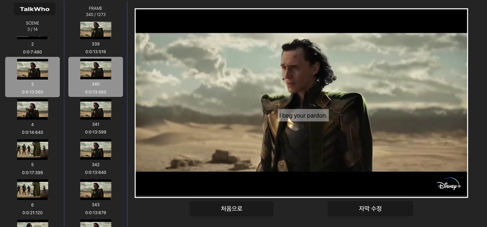
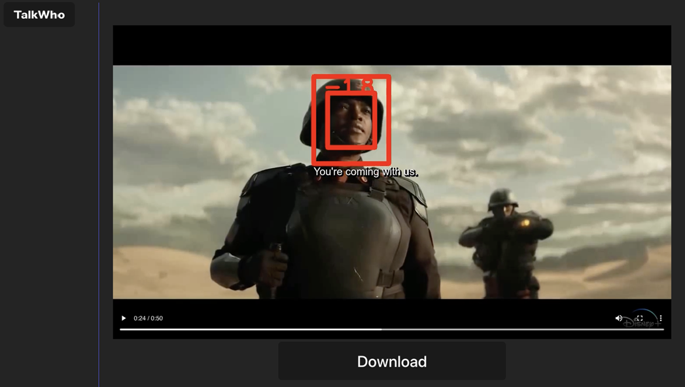
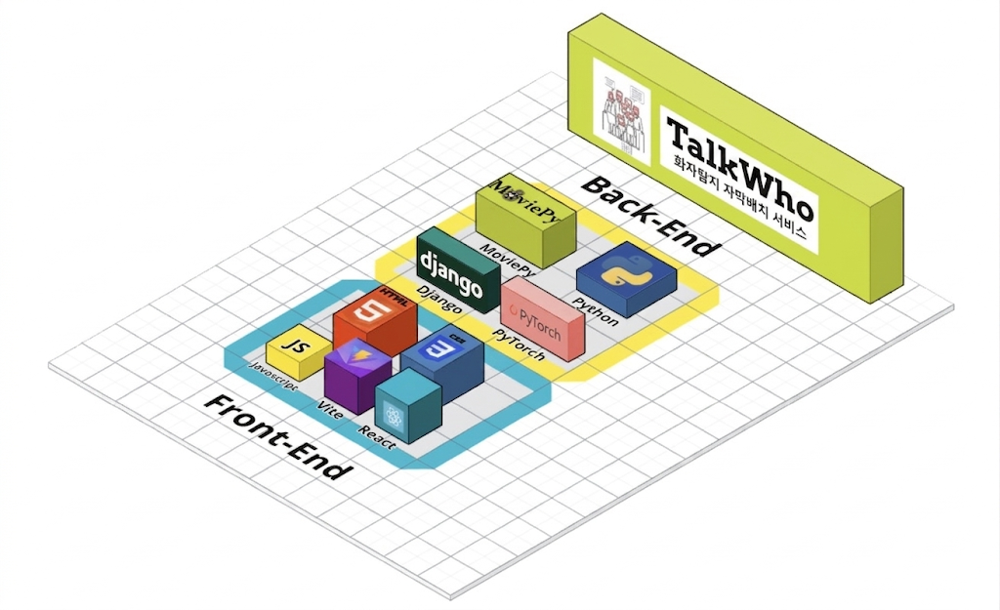
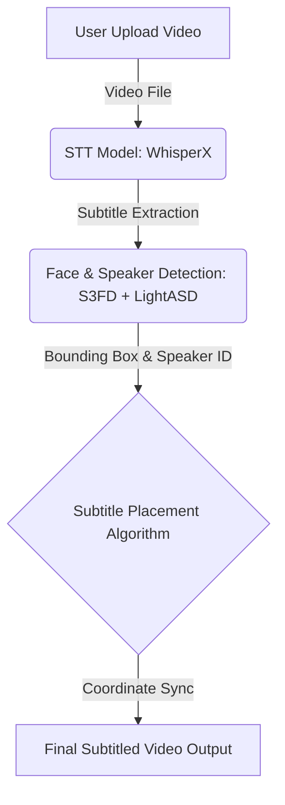

# 🏆 TalkWho (톡후)

> **화자 탐지 기반 자막 자동 배치 시스템** <br/>
> 시청자의 몰입도와 가독성을 극대화하는 새로운 자막 경험을 제공합니다.

<p align="center">
  
</p>

<div align="center">
  
  
  <a href="https://youtu.be/chRTAd88yDI"></a>
</div>

<br>

## 📌 Hackathon Information

<p align="center">
  
</p>

<div align="center">

| 항목 | 내용 |
| :--- | :--- |
| **대회명** | TECH4GOOD Hackathon |
| **주최/주관** | SK텔레콤 & 하나금융그룹 |
| **대회 기간** | 2024.07.31 ~ 2024.08.22 |
| **수상 내역** | **🏆 대상 (Grand Prize)** |
| **팀명** | 아직은 티끌s (5인 팀) |

</div>
<br>

### 📰 관련 기사 / 언론 보도

<p align="center">
  
</p>

- 🔗 [SKT-하나금융그룹, ‘TECH4GOOD해커톤’ 대회 성료](https://news.sktelecom.com/206545)
- 🔗 [SKT, 하나금융과 ‘TECH4GOOD 해커톤’ 대회 성료... "대상에 아직은티끌s팀"](https://www.kdfnews.com/news/articleView.html?idxno=138373)

<br>

## 🧑‍💻 Team Members

<div align="center">

| 김건우 | 오지완 | 이소민 | 이현우 | 표성주 |
| :---: | :---: | :---: | :---: | :---: |
|  |  |  |  |  |
| | | | [](https://github.com/hyunooss) | [](https://github.com/piosj) |
</div>
<br>

## 📖 Project Overview

### 🚨 배경 및 문제점
기존의 자막 서비스는 단순히 화면 하단에 고정되어 있어, **화자가 여러 명일 경우 누가 말하고 있는지 직관적으로 파악하기 어렵다**는 한계가 있었습니다.

### 💡 솔루션: TalkWho
본 프로젝트는 **화자 탐지(Speaker Detection) 기반 자막 자동 배치 시스템**입니다. 
실시간이 아닌 기존 영상에 대해 화자를 정확히 인식하고, **가장 최적의 위치(화자 주변)에 자막을 자동으로 배치**하여 시청자의 몰입도와 가독성을 크게 향상시킵니다.

### ✨ 주요 기능
- 🎙️ **음성 텍스트 변환 (STT)** : `WhisperX` 모델을 활용하여 영상에서 고정밀 자막 파일을 추출합니다.
- 🧑 **얼굴 인식 (Face Detection)** : `S3FD` 모델을 사용하여 영상의 각 프레임마다 등장인물의 얼굴을 탐지합니다.
- 🗣️ **화자 탐지 (ASD)** : `Light-ASD` 모델을 통해 각 장면에 실제 말을 하고 있는 화자가 누구인지 판별합니다.
- 🎯 **지능형 자막 배치** : 탐지된 화자의 위치 데이터를 기반으로 화자 주변에 자연스럽게 자막을 배치합니다.
- ✏️ **자막 커스터마이징** : 사용자가 직접 자막의 위치와 내용을 추가적으로 수정하고 편집할 수 있는 웹 에디터를 제공합니다.

<br>

### 서비스 구성
| 페이지 | 뷰 | 기능 |
|---|---|---|
| Home |  | - 자막 언어 선택<br> - 동영상 업로드 |
| Edit |  | - <b>자동 자막 배치</b> <br> - 자막 수정<br> - 자막 합성 |
| Result |  | - 영상 다운로드 |


## 🛠 Tech Stack

<p align="center">
  
</p>

<div align="center">

### Frontend
  

### Backend
  

### AI / ML
   

</div>
<br>

## 🏗 System Architecture



## 🚀 Getting Started
프로젝트를 로컬 환경에서 실행하기 위한 방법입니다.

1️⃣ FrontEnd (Web) 실행
```
# 클라이언트 디렉토리로 이동
cd Client/client

# 패키지 설치 (npm 또는 yarn 사용)
yarn install 
# 또는 npm install

# 개발 서버 실행
yarn dev 
# 또는 npm run dev
```

2️⃣ BackEnd (Server) 실행
```
# 1. 필요 패키지 설치
pip install -r requirement.txt

# 2. WhisperX 모델 설치
pip install git+[https://github.com/m-bain/whisperx.git](https://github.com/m-bain/whisperx.git)

# 3. 서버 디렉토리로 이동 및 실행
cd Server/talkwho
python manage.py runserver

# => Server runs on http://localhost:8000
```